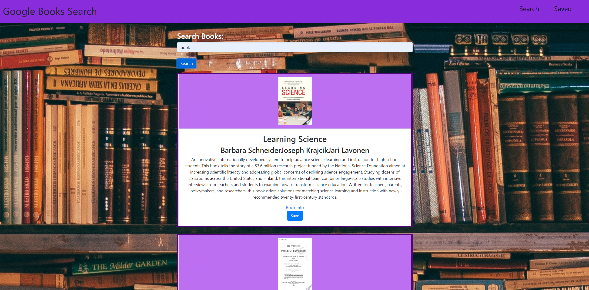
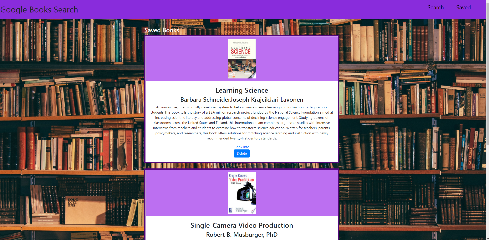

# Google Books Search React
 

## Description
This application is a React-based Google Books Search App. It uses React components, helper/util functions, and utilizes React lifecycle methods to query and display books based on user searches. The application is build with Node, Express and MongoDB so that users can save books to review or purchase later.

## Credits

A link to the [React Google Books Search](https://fathomless-shelf-32899.herokuapp.com/) application is deployed on Heroku. 

A link to the [React Google Books Search](https://github.com/nikolaslenning/Google-Books-Search-React) repository is hosted on Github.

This application was authored by [Nikolas Lenning](https://github.com/nikolaslenning)